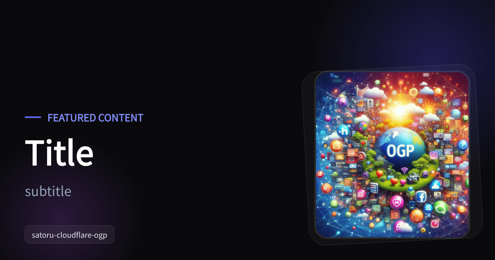

# Cloudflare OGP Generator (Satoru)

A high-performance OGP image generator running on **Cloudflare Workers**, powered by **Satoru Wasm**.

This package demonstrates how to use Satoru to generate dynamic social media images (OGP) at the edge using React (JSX) and Tailwind-like inline styles.

---

## Sample Image



## 🚀 Features

- **Edge-Side Rendering**: Generates PNG images directly on Cloudflare Workers using WebAssembly.
- **React Integration**: Define your OGP layouts using familiar JSX syntax via `satoru-render/react`.
- **Automatic Font Loading**: Uses Google Fonts (Noto Sans JP) with automatic resolution.
- **Modern UI**: Dark-themed layout with decorative elements and image support.
- **High Performance**: Optimized Wasm binary for fast cold starts and execution.
- **Dynamic Content**: Accepts query parameters to customize titles, subtitles, and images.

---

## 🛠️ Getting Started

### 1. Installation

Ensure you have installed the dependencies:

```bash
pnpm install
```

### 2. Local Development

Start the local development server using `wrangler`:

```bash
pnpm dev
```

The worker will be available at `http://localhost:8787`. You can test it by visiting:
`http://localhost:8787/?title=Hello+Satoru&subtitle=Ultra-fast+image+generation+on+Cloudflare+Workers`

### 3. Deployment

Deploy the worker to your Cloudflare account:

```bash
pnpm deploy
```

---

## 📖 API Reference

### `GET /`

Generates an OGP image based on the provided query parameters.

| Parameter  | Type     | Default                    | Description                   |
| :--------- | :------- | :------------------------- | :---------------------------- |
| `title`    | `string` | `"Title"`                  | The main title text.          |
| `subtitle` | `string` | `"subtitle"`               | The subtitle text.            |
| `image`    | `string` | (A sample landscape image) | URL for the decorative image. |

**Example Request:**
`https://your-worker.workers.dev/?title=My+Awesome+Post&subtitle=Read+more+on+my+blog&image=https://example.com/image.jpg`

---

## 🧩 How it Works

The generator uses a combination of **React**, and **Satoru**:

1.  **Request Handling**: Parses query parameters from the URL.
2.  **React (JSX)**: Defines the visual layout and styles using standard React components.
3.  **satoru-render/react**: Converts the JSX elements into an HTML string, including Google Fonts integration.
4.  **Satoru**: Renders the HTML string into a PNG buffer using the Skia graphics engine compiled to Wasm.
5.  **Caching**: Utilizes Cloudflare Workers KV/Cache API for performance.
6.  **Response**: Returns the PNG buffer with `Content-Type: image/png` and cache headers.

```tsx
// src/index.tsx snippet
const html = toHtml(
  <html style={{ margin: 0, padding: 0 }}>
    <head>
      <link
        href="https://fonts.googleapis.com/css2?family=Noto+Sans+JP:wght@100..900&display=swap"
        rel="stylesheet"
      />
    </head>
    <body style={{ margin: 0, padding: 0 }}>
      <div
        style={{
          width: "1200px",
          height: "630px",
          background: "#0a0a0c",
          display: "flex",
        }}
      >
        {/* Your OGP Design */}
        <div style={{ fontSize: "80px", color: "#ffffff", display: "flex" }}>
          {title}
        </div>
      </div>
    </body>
  </html>,
);

const png = await render({
  value: html,
  width: 1200,
  height: 630,
  format: "png",
});
```

---

## 📜 License

MIT License - SoraKumo <info@croud.jp>
